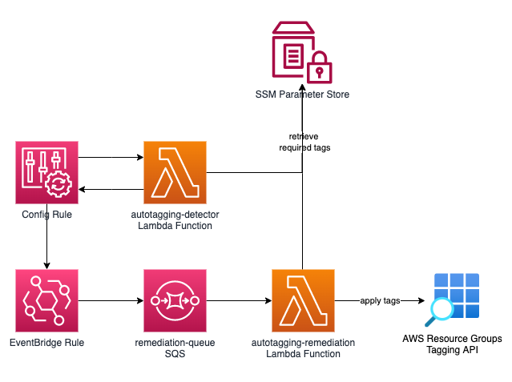

# AWS Resource Auto-tagging Solution

This repository provides an automated solution to enforce mandatory tags on AWS resources using AWS Config Rules and Lambda functions.

## Disclaimer
This project is for demonstration purposes and should be thoroughly reviewed and tested before using in production environments.

## Overview

The solution automatically detects resources that are not compliant with the organization's tagging standards and applies the required tags. This helps maintain consistent resource tagging across your AWS environment with minimal manual intervention.

## Architecture Diagram



The solution works as follows:
1. AWS Config Rule continuously monitors resources for required tags
2. When non-compliant resources are detected, EventBridge triggers the remediation workflow
3. Events are queued in SQS for reliable processing
4. Lambda function retrieves the required tag values from SSM Parameter Store and applies them to the non-compliant resources

## Pre-requisites

1. **AWS Config** must be enabled in your AWS account
2. **Terraform** installed locally
3. Required IAM permissions to create the necessary resources

## Deployment Steps

1. Clone this repository

2. Initialize Terraform:
    ```bash
    terraform init
    ```

3. Review and modify variables in `terraform.tfvars` if needed:
    ```hcl
    cost_center_value = ""
    department_value = ""
    compliance_resource_types = [
        "AWS::SQS::Queue",
        "AWS::DynamoDB::Table"
    ]
    ```

4. Deploy the solution:
    ```bash
    terraform plan
    terraform apply
    ```

## Customization

1. To modify the set of mandatory tags:
   - Modify or add SSM Parameters in the Terraform code
   - The current mandatory tags are:
     - CostCenter
     - Department

2. To add support for additional resource types:
   - Update the `compliance_resource_types` variable
   - Add service-specific tagging logic in the remediation Lambda function if needed

3. Consider storing the Terraform state in a remote backend such as S3. An example commented out code is included in `providers.tf`.

## Considerations

- This solution works for resources that are supported by AWS Config. See [AWS documentation](https://docs.aws.amazon.com/config/latest/developerguide/resource-config-reference.html) for a full list of supported AWS resource types. Examples of unsupported services: ElastiCache, Managed Workflows for Apache Airflow (MWAA)
- The remediation function in this solution leverages AWS Resource Groups Tagging API to apply tags to resources. See [AWS documentation](https://docs.aws.amazon.com/resourcegroupstagging/latest/APIReference/supported-services.html). For resource types that are not supported, you can add a custom function to use the service-specific APIs to apply tags. In this respository, an example implementation for EventBridge Rule is included for reference.
- Resource types must be explicitly defined in the Config Rule scope
- Maximum tag value length and character restrictions apply as per AWS limits
